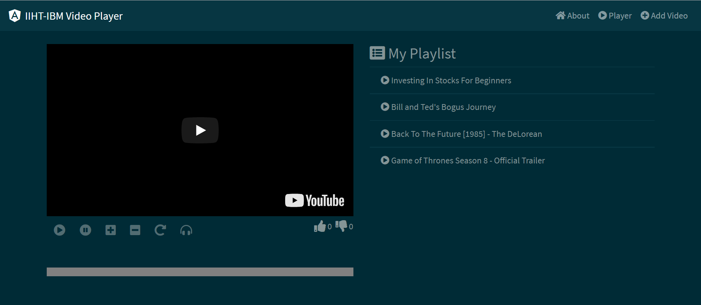
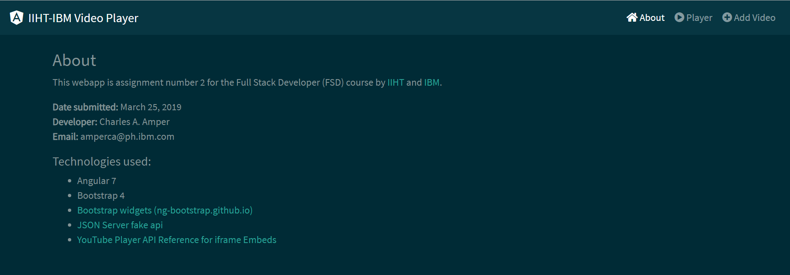
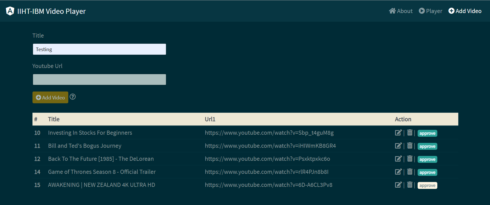

# About

This webapp is assignment number 2 for the Full Stack Developer (FSD) course by IIHT and IBM.

## Built With
* [Angular 7](https://angular.io)
* [Bootstrap 4](https://getbootstrap.com)
* [Bootstrap widgets](https://ng-bootstrap.github.io)
* [JSON Server fake Rest API](https://github.com/typicode/json-server)
* [YouTube Player API Reference for iframe Embeds](https://developers.google.com/youtube/iframe_api_reference)

## Author
* **Charles Amper**

* **Date submitted** : March 25, 2019
* **Training date** : December 2018 - ongoing

## Installing
### prerequisite

Install 
JSON FAKE API 

```
npm install -g json-server
```
### Steps

1. Run
```
  git clone https://github.com/talbhoggs/iiht-ibm-training2.git
```
2. In the root folder in step 1 run 
```
  npm install
```
3. Once installed. Open two terminals (bash or cmd) in the root folder  
* For terminal 1:  
Run
 ```
   ng serve
 ```
* For terminal 2:  
Run
 ```
   json-server --watch database.json
 ```

 4. Run this by opening your favorite web browser.

UI:
 ```
   http://localhost:4200
 ```
Fake REST:
 ```
   http://localhost:3000/playlist
 ```

**Congratulations your done!**

## Screenshots

### Main page


### About page


### Add Video page


